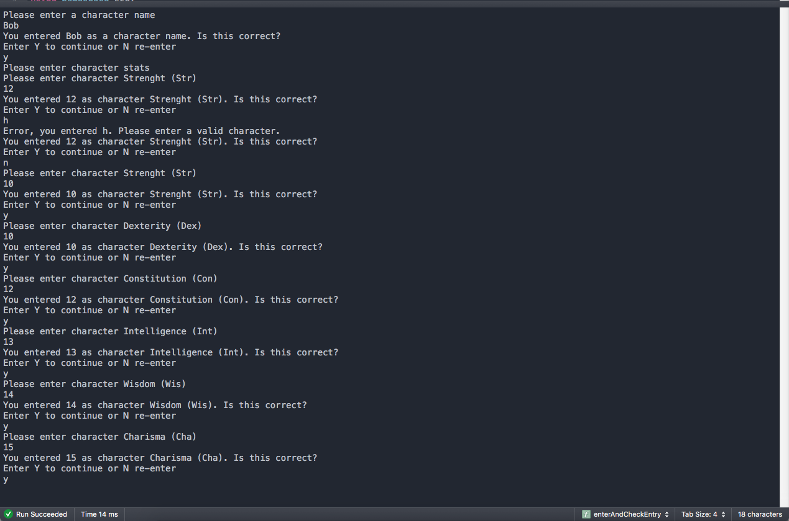
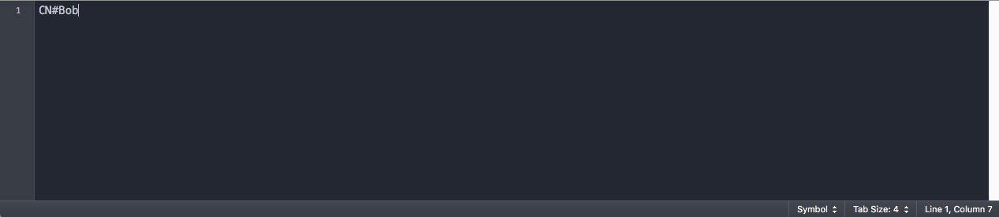

# C-Final
Character data entry

## Synopsis & Motivation
I wanted to create a tool to help me in the further develop of a tabletop role-paying system. My goal was to develop a tool that offers the benefits of being able to easily track and coordinate resources and that also offers the open and adaptive nature of tabletop games. I was able to create code within the time given to allow a user to store a character name and character stats. I plan to continue adding a main menu for a user that will display basic character information and that will offer menu options that allow a user to view a list of: combat skills, none-combat skills and inventory items. A user would be able to display the details of these options and utilize, edit or delete any details from these lists.

## Pseudocode overview
```
int main()
{
fileCheckOrCharacterNameEntery(downloadFromFileToProgram/AskEnteryAndUploadToFile, enterAndCheckEntry)
characterStats(downloadFromFileToProgram/AskEnteryAndUploadToFile, enterAndCheckEntry, stateModBonusUploadToFile)
}//end main

Function definitions
```

## Install procedure
NA

## Licensing
I don't want others to use it at this time

## Picture Example
Command prompt
Text file (note: active data would be encoded into the file at the end of the program)




